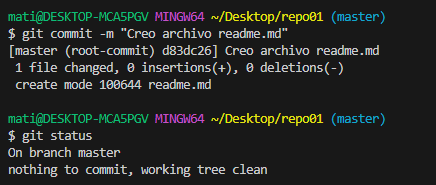

# EJERCICIO 1:  
**:one: 1.1 – Crea un directorio llamado repo01 en local (desde tu máquina) e ejecuta el comando pertinente para que dicho directorio para que se transforme el repositorio en local ¿Cómo podemos identificar que el repositorio se ha inicializado?**  
>($ git init repo01)
- Se crea un directorio llamado: .git (oculto) en el interior del directorio. 
  

**:two: 1.2 – Añade un documento llamado readme.md dentro del repositorio (recuerda que MD es la extensión de los ficheros Markdown) y documenta en su interior todos los pasos que vas realizando para crear un repositorio, etc. Puedes añadir fotos o lo que creas conveniente**  

**:three: 1.3 – Añade el fichero que acabamos de añadir al repositorio al staging area, visualiza el estado del repositorio (con git status) y haz un snapshot (commit) del fichero hacía nuestro repositorio local. ¿En que “file status lifecycle” se encuentra el fichero?**  
- Committed puesto que ya hemos hecho el commit.

  
**:four: 1.4 – Intenta subir los ficheros al repositorio remoto mediante al comando git push ¿Se te ocurre que está pasando? (si no lo sabes aún no te preocupes)**  
- No hay asociado un repositorio remoto al local.

**:five: 1.5 – Ejecuta el comando git remote –v e investiga porque no nos aparece nada**
- Hay que asociar el repositorio remoto antes.
  
**:six: 1.6 – Crea un repositorio remoto llamado repo01, asócialo a tu repositorio local**  
**:seven: 1.7 – Vuelve a ejecutar el comando git remote –v nuevamente y explica el porque ahora si que aparece**  
- Porque ahora si lo hemos asociado y por lo tanto lo detecta.

**:eight: 1.8 – Sube los cambios que hemos subido al snapshot local (commit) hacía al repositorio remoto**

**:nine: 1.9 – Ves al repositorio remoto (en este caso GitHub) y comprueba que se haya realizado el commit correctamente y observa que pasa en el repositorio ¿Observas algo peculiar?**
- No se a que te refieres con peculiar, me parece todo correcto.

## Resumen:
_Primero inicio git local: $git init_  
_Creo el archivo readme.md: $cat >readme.md_  
_Añado el archivo al String Area: $git add readme.md (o en este caso tmb podria ser git add .)_  
_Miro el estado actual del git: $git status (me sale el archivo en SA)_  
_Hago un snapshot: $git commit -m "Creo archivo readme.md"_  
_Miro el estado actual del git: $git status (me sale que no tengo nada más que commitear)_  
_Finalmente creo el repo en gitHub y lo subo:_  
_git remote add origin https://github.com/LiaPuigmi/repo01.git_  
_git branch -M main_  
_git push -u origin main_